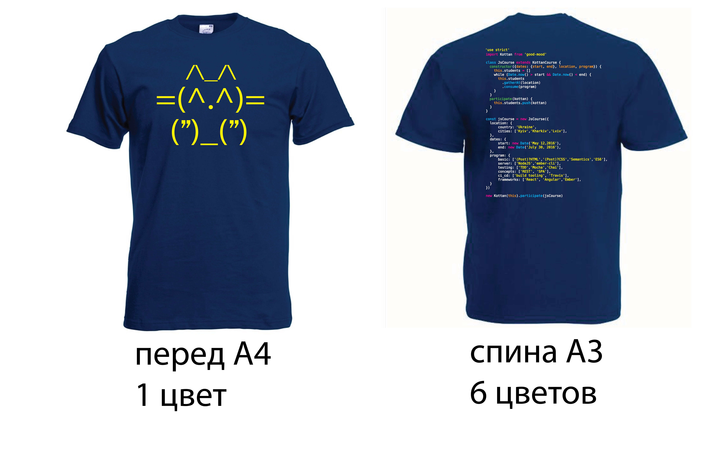

# JS2016-3

### What are we doing:

- t-shirts
- hoodies

# [Sources](kottan-JS-3-final.ai)

### How do they look like?

#### Front

#### Back

#### Overall

## What to say to those who will deliver your order
| prop | value |
| --- | --- |
|print type| **flex**|
|front size | A4 |
| back size | A3 |
* be aware of the cloth quality 

### Copyrights and thanks
- code @sudodoki && @shvaikalesh
- design @YanaPlotnyk

## Previous examples 

